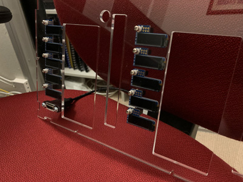

## Contents
   * [Overview][0]
   * Part1 - Case assembly (this page)
   * [Part2 - Raspbian Install][2]
   * [Part3 - PiOLED service and configuration scripts][3]
   * [Links and Acknowledgements][links]

Finally, all the parts have arrived.  Like a kid on Christmas, I started unwrapping everything. 

* 10 x 4GB Rpi4 boards
* 10 x 16GB microSd cards
* 10 x piOLED displays
* 2 x 30Pack of jumper wires 7.8" F/M
* 1 x PicoCluster 10H advanced kit case and materials

Pico Cluster provide some pretty decent guides for assembling their kit, located [here](https://www.picocluster.com/blogs/picocluster-assembly-instructions/assemble-pico-10h-rpi4). The case is effectively two stacks of 5 pi boards that are all joined together via an ethernet bridge.   Instructions to build the individual stacks are on [this page](https://www.picocluster.com/blogs/picocluster-assembly-instructions/assemble-raspberry-pi-board-stack-high-power).

To give some more context on its size, the front face is almost exactly 300mm wide, and ~197mm high, and about 190mm deep.

For the most part everything just worked which is always pleasant. But I did run into some minor product variations/issues.  

First, there wasn't any info for which heatsinks applied to which chips on the Raspberry pi 4.   In the end, I decided to risk it and just go with what other [bloggers](https://www.hackster.io/news/raspberry-pi-4-firmware-updates-tested-a-deep-dive-into-thermal-performance-and-optimization-2f22c78e7089) had said (which is heat sinks on CPU, USB, and network chips).  Time will tell if they work sufficiently or not.  Backup plan is to add piromi fans if the heatsinks don't cut it.

Jumper wires for connecting the GPIOs to the oLED displays.

As I started building the stacks, I found that some of the standoff screws would not fit through the raspberry pi board holes which was bit annoying.  Reading online it seems this is a fairly common issue with the raspberry pi board's manufacturing.  After further research I found several people who said they just gently pushed the standoff screws through, or in one case hand drilled the holes to be the correct size.  While bit fiddly, everything for the stacks was finished by around midday on sunday morning.  

With the pi stacks assembled, the next phase was the 10H case.  As the case came together I was pleasantly surprised at the design - its been done very well: the bottom of the case is the only unmovable part (since the pi stacks screw directly into it).  All the other panels - front, back, sides and top; can be added or removed individually! None of the sides need any of the others to hold it together or keep the thing rigid - thats due to some simple but effective interlocking dovetail-style flanges and the drop-in screw and tighten design.  

The top of the case has the same design as well, and can be lifted off in the event of needing to swap out an sd card, or if you have very small fingers, getting to some of the GPIO pins.  Only thing to note is that the right-hand side panel which has the switch mounted directly to it, so you'd need to detach the switch power plug and all network cables to get that panel off.

On the case that I received, unfortunately the AC power switch's holes and the holes in the case were not quite aligned.  After doing a few measurements and comparisons, the simplest option was to just hand drill additional holes in the AC switch to match the  holes in the case. (Well away from any of the electrical points luckily).

Few more photos as the case came together.

Next hurdle was the case fans.  I think picocluster must have been in the middle of updating their products to use different fans because the ones I received didn't come with screws that could reach all the way through the case and into the holes on the fans.  I emailed the company and asked what I should do and they responded quickly and helpfully. They seemed as surprised as I was and in the end suggested to flip over the fans and use the self-tapping screws.  Try as I might, I couldn't figure out what they meant, so I just went to jaycar and bought some screws and nylon nuts.  

At this point it occurred to me that these extra cross-pieces in the holes for the fans were a bit overprotective. Some quick math confirmed my guess, by removing centre cross pieces from the fan holes it would increase useable area (directly in front/behind the blades) by nearly 30%.  With a hacksaw, I gently cut them out, and the sanded off the edges.  I then measured and drilled the holes for mounting the oLED displays.

Screws and nylon nuts for mounting the oLED displays - I couldn't find any washers that could fit without banging into the black GPIO female pinout block, so I just bought an extra 10 nylon nuts and drilled the threads out.

Mounting oLED displays to the front panele of the case.

Here's reference photo for the power module - I found the official one was too tiny for me :) , with power supply, fans, and ac power switch installed.

I attached the back panel to the base, and connected the power cables to the pi stacks, did a test power up to see how it was looking.  With no further issues, I assembled the rest of the case.  

Attaching the jumpers to the oLED displays. Another fun game of [mental rotation :)](https://en.wikipedia.org/wiki/Mental_rotation). 

NOTE: While it hasn't directly impacted anything yet, anyone else following this guide should be aware that they should plug into the micro hdmi cable into the port0 socket on the left-top pi.  Online docs as-at Jan 2019 stated that port0 had slight improved performance at 60Hz mode for 4K resolutions. Regardless, the left side of the pico case is so close to the hdmi connectors that you'll have to remove the left panel completely in order to change sockets.

Wiithout much further event, the rest of the assembly was completed, and network and power cables attached.  Final pictures here. I chose to skip screwing on the top plate given that it sits within recessed , and would make it easier to access the sd cards or a cable or two if needed.

[Part2 - Raspbian Install][2] continues next.

[0]:README.md
[1]:part1.md
[2]:part2.md
[3]:part3.md
[4]:part4.md
[5]:part5.md
[links]:links.md
